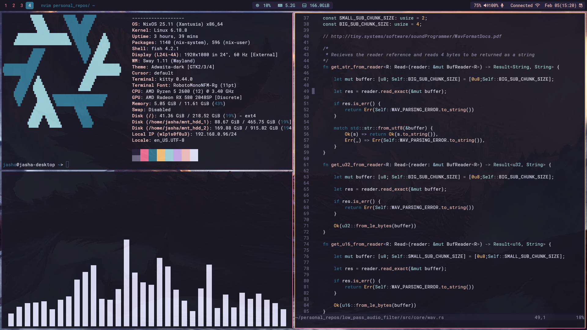

# dotfiles
My workstation dotfiles. I recommend installing the nerd fonts since it's a large repository of all the fonts you'll probably need.

Btw, I included the NixOS config too, but the individual configurations will work on other repos.

**Note**: If the icons don't show correctly in waybar try `fc-cache -r`

