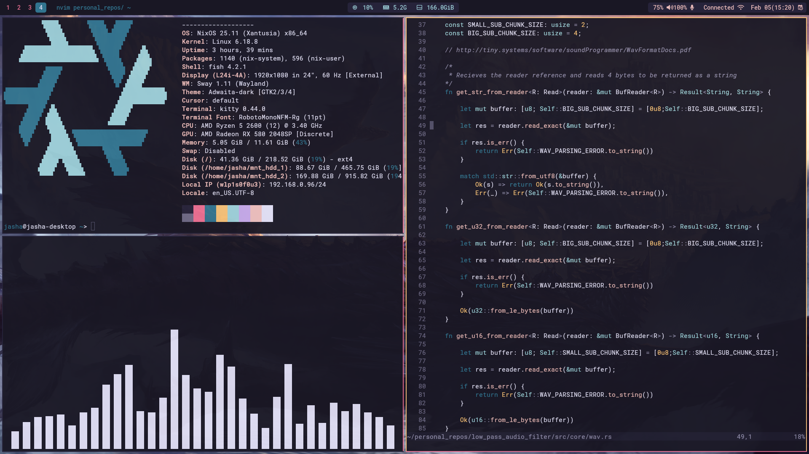

# dotfiles
My workstation dotfiles. 

Btw, I included the NixOS config too, but the individual configurations will work on other repos.

**Note**: If the icons don't show correctly in waybar try `fc-cache -r`



## Additional content

### Set **nnn** default program 

Simply run the `xdg-mime` commnad. For example:

```
xdg-mime default mpv.desktop video/mp4
```

